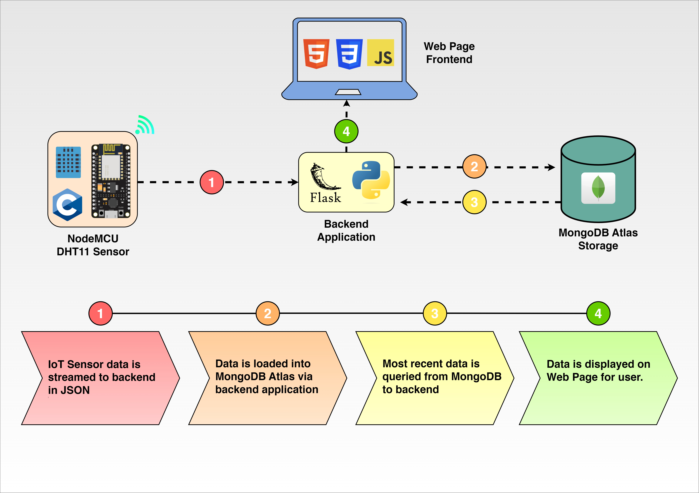

# NodeMCU Weather App

This project allows you to monitor real-time temperature and humidity values from a NodeMCU (ESP8266) with a DHT11 sensor, and displays the data on a web page using Flask.

## Note:

MongoDB section is being worked on currently

## Project Structure

- `esp/esp.ino`: Arduino code for the NodeMCU and DHT11 sensor.
- `static/script.js`: JavaScript file for the web page.
- `static/styles.css`: CSS file for styling the web page.
- `static/thermometer_asset.png`: PNG asset for the thermometer.
- `templates/index.html`: HTML file for the web page.
- `app.py`: Flask application for handling sensor data and serving the web page.
- `mongo.py`: Local Module that handles all the operations for MongoDB database.
- `diagram.png`: Project plan diagram.
- `.gitignore`: Git configuration file to ignore certain files from version control.

## How It Works

1. The NodeMCU gathers temperature and humidity data using the DHT11 sensor.
2. The data is transmitted to the Flask application endpoint in JSON format.
3. The Flask application processes the data and updates the web page in real-time.

## Requirements

### Hardware Requirements

- [NodeMCU (ESP8266)](https://nodemcu.readthedocs.io/en/release/)
- [DHT11 Sensor](https://www.mouser.com/datasheet/2/758/DHT11-Technical-Data-Sheet-Translated-Version-1143054.pdf)

### Software Requirements

- [Python 3.6 or higher](https://www.python.org/doc/versions/)
- [Flask 1.0 or higher](https://flask.palletsprojects.com/en/1.1.x/)
- [MongoDB 4.0 or higher](https://docs.mongodb.com/manual/release-notes/4.0/)
- [Arduino IDE](https://www.arduino.cc/en/Main/Software)

### Python Libraries

- [Flask](https://flask.palletsprojects.com/en/1.1.x/)
- [PyMongo](https://pymongo.readthedocs.io/en/stable/)

### Arduino Libraries

- [ESP8266WiFi](https://arduino-esp8266.readthedocs.io/en/latest/esp8266wifi/readme.html)
- [DHT sensor library](https://www.arduino.cc/reference/en/libraries/dht-sensor-library/)

## Getting Started

1. Connect the DHT11 sensor to the NodeMCU as per the `esp/esp.ino` code.
2. Upload the `esp/esp.ino` code to the NodeMCU using the Arduino IDE.
3. Run the Flask application by executing `python app.py` in your terminal.
4. Open your web browser and navigate to specified url to view real-time temperature and humidity values.

## Project Diagram

